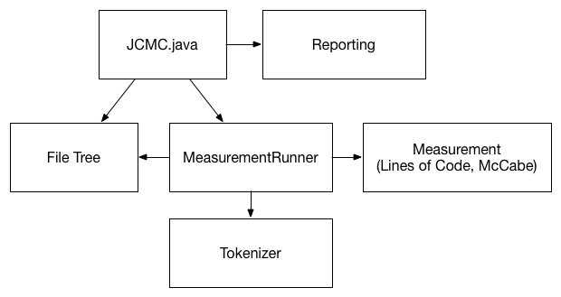

# Design of Java Code Metrics Calculator (The trainiers)

## Context

### Goal

Objective of the Java Code Metrics Calculator (JCMC) is to be able to determine the maintainability of Java software. It will do so by providing various code metrics, such as lines of code and McCabe Cylcomatic Complexity.

### Key requirements

JCMC will be run from the commandline, taking a directory (containing Java source code) as its input, and will provide a text file as output, containing metrics.

JCMC will be robust, and it will not fail when encountering non-compiling Java files.

### Risks

JCMC is developed as part of the DHL Training Module II. It must therefore achieve at least two of these four objectives by Day 5 of the training:

1. All functional requirements have been fulfilled
2. The design is documented
3. ISO 25010 maintainability is at least 4 stars
4. Test coverage is at least 80%

The risk of this objective not being achieved is mitigated by instructors being present to assist, as well as result inspections and discussions on Day 2 and 4 of the course.

## Solution

the high-level architecture, containing the main components of our solution is discussed in the next section.
::Describe your solution here. Be sure to describe (important) decisions, their reasons, consequences and any trade-offs involved::

### High-level architecture

The main components of the architecture are:

<dl>
  <dt>JCMC.java (eu.sig.handsontraining)</dt>
  <dd>Entry point of the program. Creates a file tree for the given codebase directory and calls the measurement runner to do the LOC and McCabe analyses. It also calls the report generator for the output</dd>
  <dt>File Tree (eu.sig.handsontraining.filetree)</dt>
  <dd>A data structure to hold all the directories and files of the given codebase directory. This structure is traversed by the measurement runner</dt>
  <dt>MeasurementRunner (eu.sig.handsontraining.measurement)</dd>
  <dd>Runs a measurement (e.g. Lines of Code, McCabe) over all file nodes in a file tree, aggeregating metrics to directory nodes</dd>
  <dt>Measurement (eu.sig.handsontraining.measurement)<dt>
  <dd>Contains the metric calculators for Lines of Code and McCabe.</dd>
  <dt>Tokenizer (eu.sig.handsontraining.tokenizer)</dt>
  <dd>Contains a Java tokenizer based on CheckStyle.
  <dt>Reporting (eu.sig.handsontraining.reporting)</dt>
  <dd>Generates a CSV report file and top-10 lists for Lines of Code and McCabe of production and test code.</dd>
</dl>

### Technology

The use of Java as the programming language is mandated by the DHL Training Module II, and cannot be deviated from. 

::Complete the section with more on your chosen technologies::

